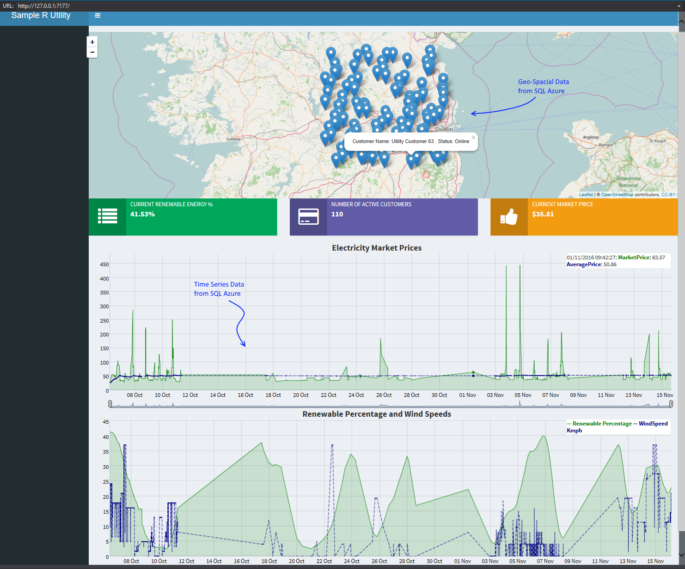

# Overview
This is a sample R ShinyApp application which shows how to query data from a SQL Azure database in the Microsoft Azure cloud and visualise that data, which contains geospacial coordinates, onto a World Map. 

#Demo Screenshot

# Usage Guide
1. Clone the repository to your local machine
2. Create or open your Microsoft Azure account
3. Restore the sample Sql Azure Database File in the SampleSqlAzureDatabaseFile folder to a SQL Azure Server in your Azure Subscription. If you don't have a SQL Azure Server yet, create one as per https://docs.microsoft.com/en-us/azure/sql-database/sql-database-get-started
4. Update the connection settings in your copy of the solution  to replace  **YourSqlAzureDatabaseHere** with the name of your SQL Azure Server and database name you just restored
5. Run the solution locally with the "local" connection string uncommented. The solution will launch a ShinyApp application which connects to your SQL Azure database and visualise the geo-spacial data in the SQL Azure database to a world map, and dynamic charts
6. To deploy the application to ShinyApps.io, uncomment the connection string commented as "Uncomment this line when deploying to Shiny" and publish. 
7. Customise as you see fit!

# Contributing

This project has adopted the [Microsoft Open Source Code of Conduct](https://opensource.microsoft.com/codeofconduct/). For more information see the [Code of Conduct FAQ](https://opensource.microsoft.com/codeofconduct/faq/) or contact [opencode@microsoft.com](mailto:opencode@microsoft.com) with any additional questions or comments.
